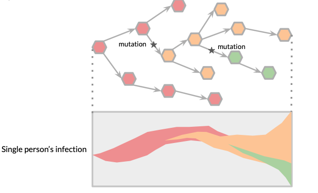
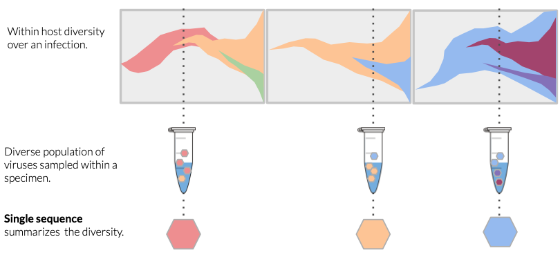

<h1 align="center" style="color: white; background-color: black; padding: 10px;">🏅🧬 Correlating Within-Host and Between-Host Fitness in SARS-CoV-2</h1>

    <b>Exascale Viral Mutation Detection across NCBI SRA for (a) Prediction and (b) New Biology</b>
      
    

# Table of Contents

- [Project Background](#-project-background)
- [Project Goals](#-project-goals)

# Project Background

> NOTE: Figures depicting viral mutations and host diversity are adapted with permission from Dr. Alli Black at the WA Department of Health. If this topic is of interest -  I recommend the [Applied Genomic Epidemiology Handbook](https://alliblk.github.io/genepi-book/).

SARS-CoV-2 virions come into contact with cells and infect them. RNA viruses are deficient in genome replication proofreading, leading to new mutations with each virion replication. Over the course of infection, these mutation errors accumulate across the genome.

As a result, there is a diverse population of viruses inside any one infected host at any one time. 

**What does this mean ?**
____________________________________________________________________________________________________________________________

During the SARS-CoV-2 pandemic, only an average genome summarizing the most frequent viral mutations was reported as a single consensus genome from a single host. These single genomes from single hosts were used to generate global-scale phylogenetic trees to track evolution and spread between hosts.

    
    

__________________________________________________________________________________________________________________________________

# Project Goals

**Project Phase 1** - build out the necessary bioinformatics infracstructure to gather and process SARS-CoV-2 raw reads from NCBI SRA.
